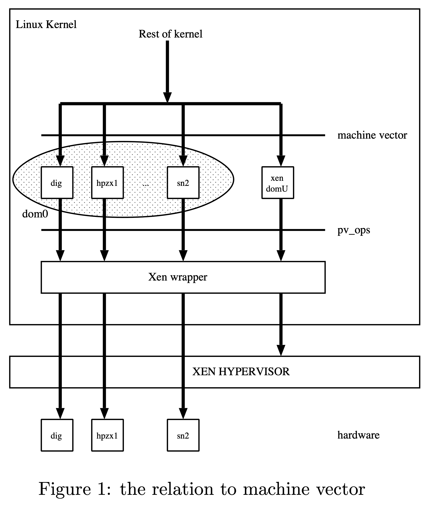

## 一，摘要

Xen/IA64 社区一直致力于 IA64 paravirt ops，以期将 Xen/IA64 更改合并到 Linux 上游中。按照x86使用的方法，实现了paravirt ops，然后修改了Xen以在paravirt ops之上运行。 在本文档中，首先将审查paravirt ops，然后讨论IA64上的 paravirt ops。 特别是，为什么在IA64上需要，x86和IA64 实现之间的差异，为什么存在这些差异，存在哪些挑战，以及当前应对这些挑战的方法。总结IA64 paravirt ops的现状，并讨论未来的计划。

## 二，什么是paravirt ops

paravirt ops（简称 pv ops）是作为在 x86 上的 Linux 内核上支持虚拟化的一种方法而开发的。 它已被开发为 API，而不是 ABI。 它允许每个管理程序在 API 级别覆盖对该管理程序很重要的操作。 它允许单个内核二进制文件在所有支持的执行环境（包括本机机器）上运行。 与通常的函数指针表的一个显着区别是它允许使用二进制补丁进行优化。
paravirt ops 的操作分为三类：
- (A) Simple indirect call (间接调用):
  这些操作对应于高级功能，因此间接调用的开销不是很重要。
- (B) Indirect call which allows optimization with a binary patch (允许使用二进制补丁进行优化的间接调用):
  通常这些操作对应于低级指令。 它们被频繁调用并且对性能至关重要。 因此，低开销非常重要。
- (C) a set of macros for hand written assembly code (一组用于手写汇编代码的宏):
  手写汇编代码（.S 文件）也需要半虚拟化，因为它们包含敏感指令或其中的某些代码路径对性能非常关键。

## 三，实现

Linux/IA64 具有 IA64 机器向量功能，允许内核根据执行平台切换实现（例如初始化、ipi、dma api...）。 实现 paravirt ops/IA64 的一种方法是增强机器向量。 但是，我们改为采用 pv ops 方法。 图 1 显示了 pv ops 与机器向量和其余内核的关系。 IA64 domU 被实现为 xen domU 机器向量和 xen domU pv ops 的组合。



常用pv ops的分类如下：
| name | description | type |
| ---- | ----------- | ---- |
| pv_info | general info | - |
| pv_init_ops | initialization | A |
| pv_cpu_ops | privileged instruction | B |
| pv_cpu_asm_ops | macros for assembly code | C |
| pv_iosapic_ops | iosapic operations | A |
| pv_irq_ops | irq related operations | A |
 pv_time_ops | steal time accounting | A |
 pv_mmu_ops | 待分析 | 待分析 |
 pv_lock_ops | lock related operations | B |

```
// arch/x86/include/asm/paravirt_types.h
/* This contains all the paravirt structures: we get a convenient
 * number for each function using the offset which we use to indicate
 * what to patch. */
struct paravirt_patch_template {
	struct pv_init_ops	init;
	struct pv_time_ops	time;
	struct pv_cpu_ops	cpu;
	struct pv_irq_ops	irq;
	struct pv_mmu_ops	mmu;
	struct pv_lock_ops	lock;
} __no_randomize_layout;
```

### Binary Patching

在撰写本文时，这些钩子被定义为 C 间接函数指针，但为了支持二进制补丁优化，它们将使用 GCC 扩展的内联汇编代码进行更改。 但是，不可能在案例中描述 IA64 C 函数调用的所有被破坏的寄存器。 所以这不是一个通用的解决方案。
在第一阶段，二进制补丁功能被放弃了，因为人们觉得很难就调用约定达成一致。

#### 内核启动时
```
x86_64_start_kernel
    |
    o -> x86_64_start_reservations -> start_kernel -> check_bugs -> alternative_instructions

    alternative_instructions()
        |
        o -> int3_selftest();
        |
        o -> stop_nmi();  CPU0上尝试屏蔽local interrapts来避免打断
        |
        o -> apply_paravirt(__parainstructions, __parainstructions_end);  // 开始打pv 二进制补丁
        |
        o -> restart_nmi();
```

#### 打入pv二进制补丁

__parainstructions & __parainstructions_end:
通过查看arch/x86/kernel/vmlinux.lds代码得知 parainstructions 作为vmlinux二进制中单独的段, 对于所有的pv ops call，保存着所有需要打补丁的代码段地址。objdump -h vmlinux 来确定该段的位置。
```
/*
	 * start address and size of operations which during runtime
	 * can be patched with virtualization friendly instructions or
	 * baremetal native ones. Think page table operations.
	 * Details in paravirt_types.h
	 */
	. = ALIGN(8);
	.parainstructions : AT(ADDR(.parainstructions) - LOAD_OFFSET) {
		__parainstructions = .;
		*(.parainstructions)
		__parainstructions_end = .;
	}
```

在native_patch函数中对对应的代码段打补丁,比如:queued_spin_unlock
```
Dump of assembler code for function _raw_spin_unlock_irqrestore:
   0xffffffff81c99a54 <+0>:     callq  0xffffffff81e01750 <__fentry__>
   0xffffffff81c99a59 <+5>:     push   %rbp
   0xffffffff81c99a5a <+6>:     mov    %rsp,%rbp
   0xffffffff81c99a5d <+9>:     callq  *0xffffffff8283ef98 // 有一项保存这里的地址
=> 0xffffffff81c99a64 <+16>:    push   %rsi
   0xffffffff81c99a65 <+17>:    popfq  
   0xffffffff81c99a66 <+18>:    pop    %rbp
   0xffffffff81c99a67 <+19>:    retq
```
而patch_data_lock.queued_spin_unlock提供patch_data(movb $0, (%rdi)),经过打补丁后queued_spin_unlock会变成:
```
(gdb) disassemble 
Dump of assembler code for function _raw_spin_unlock_irqrestore:
   0xffffffff81c99a54 <+0>:     nopl   0x0(%rax,%rax,1)
   0xffffffff81c99a59 <+5>:     push   %rbp
   0xffffffff81c99a5a <+6>:     mov    %rsp,%rbp
   0xffffffff81c99a5d <+9>:     movb   $0x0,(%rdi)
=> 0xffffffff81c99a60 <+12>:    nopl   0x0(%rax)
   0xffffffff81c99a64 <+16>:    push   %rsi
   0xffffffff81c99a65 <+17>:    popfq  
   0xffffffff81c99a66 <+18>:    pop    %rbp
   0xffffffff81c99a67 <+19>:    retq
```
numa aware spinlock和pv spinlock的情况目前没有具体研究


## 参考文献
[Paravirt Ops on Linux IA64](https://www.valinux.co.jp/wp/wp-content/uploads/2008/06/20080623_02.pdf)
